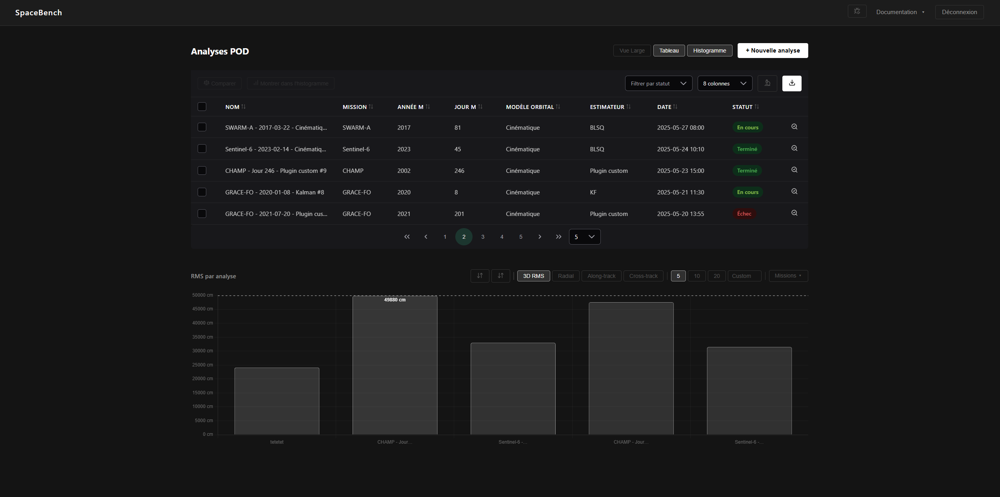

# SpaceBench - LEO-POD Framework

SpaceBench is an open-source benchmark platform for Precise Orbit Determination (LEO-POD), released under the MIT License and developed as a Master's thesis at the Université de Namur.

It lets researchers and engineers upload geodetic input files, configure an orbital model and estimator, launch a full POD pipeline run, and compare the accuracy of results through an interactive dashboard.

  <p align="center">                                                                                                                                                                                                                                                                                               
                                                                                                                                                                                                                                                     
  </p>


## Architecture Overview
SpaceBench is built as a full-stack web platform for LEO Precise Orbit Determination.

## Stack

### Frontend

| Technology | Version | Purpose                 |
|------------|---------|-------------------------|
| Angular | 19.2.x | Single-page application |
| PrimeNG | 19.1.x | UI components           |
| Chart.js | 4.5.x | Plots and histograms    |
| Lucide Angular | 0.577.x | Icons (Lucide Icons)    |
| TypeScript | 5.7.x | Frontend logic          |

### Backend

| Technology | Version | Purpose |
|------------|---------|---------|
| Python | 3.10+ | Scientific and application logic |
| FastAPI | 0.110.0 | REST API and orchestration layer |
| Pydantic | 2.6.3 | Request/response validation and settings management |
| SQLAlchemy | 2.0.28 | ORM and database access |
| Uvicorn | 0.28.0 | ASGI server |

### Data and Infrastructure

| Technology | Version | Purpose                            |
|------------|----|------------------------------------|
| PostgreSQL |    | Database                           |
| asyncpg |    | Async driver                       |
| Docker / Docker Compose |    | Local development and deployment   |
| MkDocs Material |    | Project documentation              |
| mkdocs-static-i18n |    | Multilingual documentation support |

## Scientific engine
The POD engine is implemented in Python and executed by the backend as an asynchronous background job. It validates input files, parses geodetic products, runs the selected estimator, and stores RMS results and logs in the database.


# Getting Started

---

## 1. Prerequisites

Make sure you have the following installed:

- **Docker** (version 24 or later)
- **Docker Compose**

You do not need to install Node.js, Python, or other dependencies manually → everything runs inside containers.

---

## 2. Installation

1. Download the SpaceBench package (ZIP)  
2. Extract the contents to your preferred location:

   ```bash
   unzip spacebench.zip -d ~/workspace/spacebench
   cd ~/workspace/spacebench

## 3a - Development Environment without Docker (Windows-only)

If you prefer to develop without Docker and want faster iteration, you can run the frontend and backend directly on your machine, with the provided script.

```bash
.\run_the_app_dev.bat
```

This runs:
- **Frontend** on [http://localhost:4200](http://localhost:4200)
- **Backend** on [http://localhost:8000](http://localhost:8000)

---

 **Notes**
- This method skips Docker for quicker startup and live-reload.
- Make sure you have **Node.js** and **Python 3.10+** installed.
- Docker is recommended for production.


## 3b. Development Environment with Docker (Windows, Linux - Recommended)

(on Windows) : open **Docker Desktop**

Build and start the Docker images

If you want to run it locally :
```bash
docker compose -f docker-compose.yml -f docker-compose.local.yml up -d
```
If you it to run it public : 
```bash
docker compose -f docker-compose.yml -f docker-compose.public.yml up -d
```


After the containers are started, the main services are available locally:

**Frontend (Angular Application)**  
Accessible in your browser at  
[http://localhost:8080](http://localhost:8080)

**Backend API**  
Runs internally on port `8000`

**Documentation (MkDocs Material)**  
Automatically served with the frontend container at  
[http://localhost:8080/docs](http://localhost:8080/docs)

**Swagger API documentation**  
Automatically served with the backend container at  
[http://localhost:8000/api/docs](http://localhost:8000/api/docs)

---


## 4. Se connecter

L'utilisateur par défaut pour se connecter est : 

| Champ         | Valeur    |
|---------------|-----------|
| Utilisateur   | `usertest`|
| Mot de passe  | `CHANGE_ME___kKbvtu3LbI6yYQltgWdz`|


