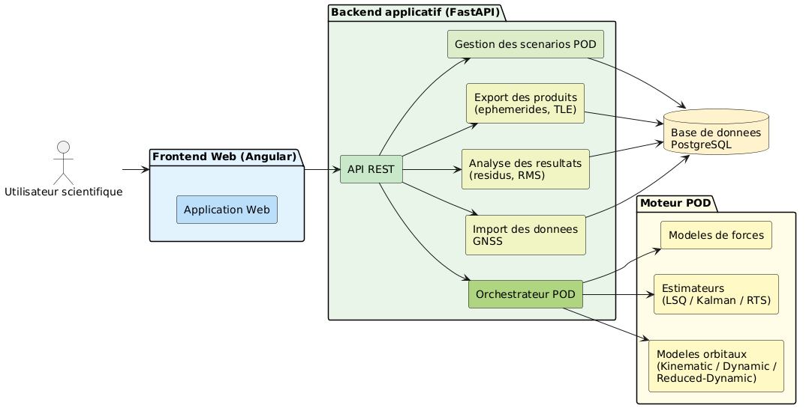
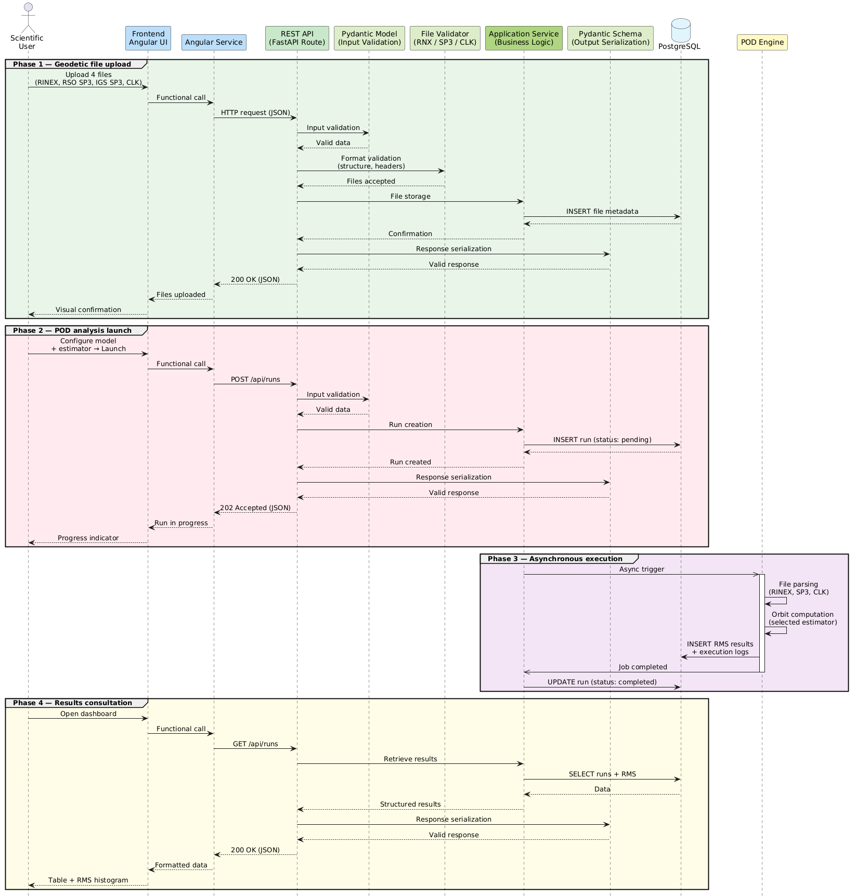

# Architecture

Cette page décrit la structure actuelle de SpaceBench : l'organisation du projet, la pile technique et l'interaction entre les composants principaux.

---

## Vue D'ensemble

SpaceBench utilise un frontend Angular, un backend FastAPI, un moteur POD FastAPI séparé et une base de données PostgreSQL. Le frontend communique avec le backend via REST. Le backend stocke les fichiers et les analyses, effectue la prévalidation à l'upload, puis lance le moteur POD de manière asynchrone lorsque l'utilisateur démarre une analyse.



Les services sont orchestrés avec Docker Compose et communiquent sur un réseau Docker interne.

---

## Organisation Du Projet

```text
spacebench/
├── backend/                         # Backend FastAPI
│   ├── app/
│   │   ├── core/                    # Connexion base de données et paramètres
│   │   ├── enums/                   # Enums fichiers, modèles, estimateurs, logs et statuts
│   │   ├── migrations/              # Seed de base de données
│   │   ├── models/pod/              # Modèles ORM SQLAlchemy
│   │   ├── routers/
│   │   │   ├── files/               # Endpoints upload/download
│   │   │   └── runs/                # Création, listing et logs des analyses
│   │   │   └── tests/               # Lancer les tests unitaires
│   │   ├── schemas/pod/             # Schémas Pydantic et métadonnées de validation
│   │   ├── services/
│   │   │   ├── runs/                # Service de lancement du moteur POD
│   │   │   └── upload/              # Service de validation d'upload
│   │   ├── validators/upload/       # Validateurs RINEX, SP3, CLK et Python
│   │   └── main.py                  # Point d'entrée FastAPI
│   ├── static/                      # Asset ReDoc local
│   ├── tests/data/missions/         # Données CHAMP D200-D219 et D246
│   ├── uploads/                     # Dossier runtime des uploads
│   └── Dockerfile
│   └── pytest.ini                   # Configuration des tests unitaires
│
├── frontend/                        # SPA Angular 19 et site MkDocs
│   ├── src/app/
│   │   ├── admin/dashboard/         # Dashboard, table, histogramme
│   │   ├── admin/new-analysis/      # Wizard de nouvelle analyse
│   │   ├── public/login/            # Page de connexion
│   │   ├── service/                 # Services HTTP
│   │   └── shared/                  # Navbar, modales, i18n
│   ├── docs/                        # Documentation MkDocs
│   └── Dockerfile
│
├── pod-engine/                      # Service de calcul scientifique POD
│   ├── app/
│   │   ├── core/                    # Paramètres et connexion base de données
│   │   ├── enums/                   # Phases, statuts et enums partagés
│   │   ├── estimators/              # Implémentations d'estimateurs
│   │   ├── models/                  # Modèles ORM de run et prototypes orbitaux
│   │   ├── parsers/                 # Prototypes de parseurs
│   │   ├── routers/analysis.py      # Implémentation du pipeline POD
│   │   ├── schemas/                 # Schémas du payload de run
│   │   └── services/run_logger.py   # Logger de run persisté en base
│   └── Dockerfile
│   └── pytest.ini                   # Configuration des tests unitaires
│
├── docker-compose.yml
├── docker-compose.local.yml
├── docker-compose.public.yml
└── run_the_app_dev.bat
```

---

## Pile Technique

### Frontend

| Technologie | Version | Rôle |
|-------------|---------|------|
| Angular | 19.2.x | Framework SPA |
| PrimeNG | 19.1.x | Bibliothèque UI |
| Chart.js | 4.5.x | Histogrammes RMS et graphiques |
| Lucide Angular | 0.577.x | Icônes |
| TypeScript | 5.7.x | Logique frontend |

### Backend Et Moteur POD

| Technologie   | Version               | Rôle                                    |
|---------------|-----------------------|-----------------------------------------|
| Python        | 3.12                  | Runtime backend et moteur POD           |
| FastAPI       | 0.110.0               | APIs REST et documentation OpenAPI      |
| Pydantic      | 2.6.3                 | Validation requête/réponse              |
| SQLAlchemy    | 2.0.28                | ORM et accès base de données            |
| Pytest        | 9.0.3                 | Tests unitaires                         |
| Uvicorn       | 0.28.0                | Serveur ASGI                            |
| georinex      | géré par requirements | Parsing RINEX et SP3 dans le moteur POD |
| NumPy / SciPy | géré par requirements | Calcul numérique et interpolation       |
| xarray        | géré par requirements | Gestion de jeux de données multidimensionnels (époques SP3/RINEX) |

### Données Et Infrastructure

| Technologie | Rôle |
|-------------|------|
| PostgreSQL 16 | Base de données relationnelle |
| asyncpg | Driver PostgreSQL asynchrone |
| Docker / Docker Compose | Déploiement conteneurisé |
| MkDocs Material | Documentation du projet |
| mkdocs-static-i18n | Documentation multilingue |

---

### Modèle de données

Le schéma ci-dessous présente le modèle entité-relation de la base de données.


La base repose sur quatre tables principales :

| Table | Rôle                                                             |
|-------|------------------------------------------------------------------|
| `runs` | Analyses POD : configuration, statut, métriques RMS              |
| `files` | Fichiers uploadés : chemin, métadonnées de validation            |
| `run_rso_files` | Table de jonction - associe plusieurs fichiers RSO à une analyse |
| `run_logs` | Logs structurés par phase, niveau et message                     |

Chaque analyse référence ses fichiers d'entrée (RINEX, SP3, CLK) par clé étrangère directe, 
tandis que les fichiers RSO passent par une table de jonction pour supporter un nombre variable 
d'arcs orbitaux par analyse. Les logs sont liés à l'analyse via `run_id` et ordonnés 
chronologiquement.

---

## Topologie De Déploiement

Dans la configuration Docker Compose locale :

| Service | Port | Notes |
|---------|------|-------|
| `spacebench-frontend` | `8080:80` | Sert Angular et MkDocs via Apache httpd |
| `spacebench-backend` | `8000:8000` | Backend FastAPI |
| `spacebench-pod-engine` | `8002:8002` | API interne du moteur POD |
| `spacebench-pgadmin` | `5050:80` | Interface locale d'administration base de données |
| `spacebench-db` | interne `5432` | Base PostgreSQL |

Dans le script de développement Windows :

| Service | URL |
|---------|-----|
| Frontend | `http://localhost:4200` |
| Backend | `http://localhost:8000` |
| Documentation | `http://localhost:8001` |
| Moteur POD | `http://localhost:8005` |

---

## Flux De Données

Le diagramme ci-dessous suit une analyse POD depuis l'upload jusqu'aux résultats.


