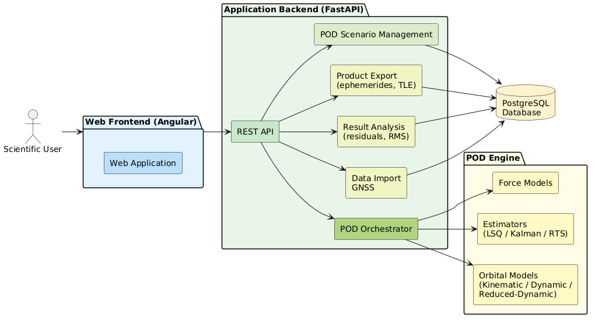
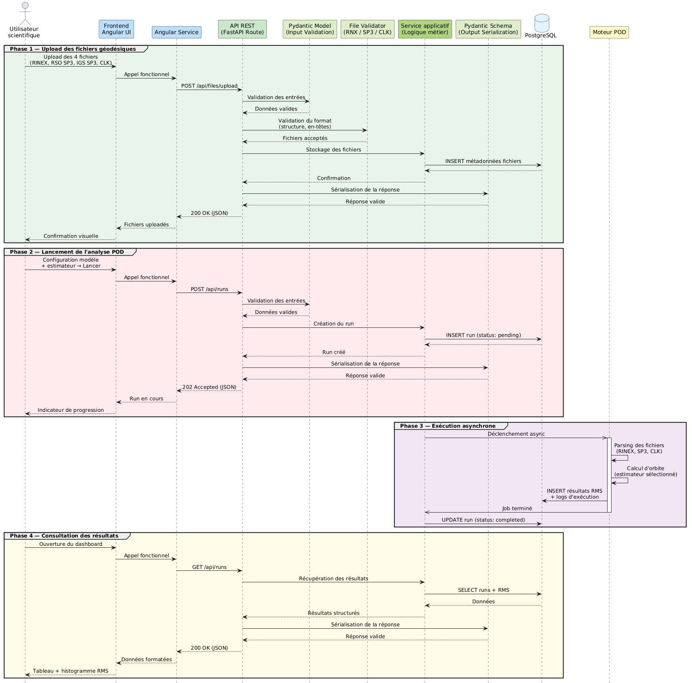

# Architecture

This page describes the current structure of SpaceBench: the project layout, the technology stack, and how the main components interact.

---

## High-Level Overview

SpaceBench uses an Angular frontend, a FastAPI backend, a separate FastAPI POD engine, and a PostgreSQL database. The frontend communicates with the backend over REST. The backend stores files and runs, performs upload-time pre-validation, then launches the POD engine asynchronously when the user starts an analysis.



The services are orchestrated with Docker Compose and communicate over an internal Docker network.

---

## Project Layout

```text
spacebench/
├── backend/                         # FastAPI backend
│   ├── app/
│   │   ├── core/                    # Database connection and settings
│   │   ├── enums/                   # File, model, estimator, log and status enums
│   │   ├── migrations/              # Database seeding
│   │   ├── models/pod/              # SQLAlchemy ORM models
│   │   ├── routers/
│   │   │   ├── files/               # Upload and download endpoints
│   │   │   └── runs/                # Run creation, listing and logs
│   │   │   └── tests/               # Run unit tests
│   │   ├── schemas/pod/             # Pydantic schemas and validation metadata
│   │   ├── services/
│   │   │   ├── runs/                # POD engine launch service
│   │   │   └── upload/              # Upload validation service
│   │   ├── validators/upload/       # RINEX, SP3, CLK and Python validators
│   │   └── main.py                  # FastAPI app entry point
│   ├── static/                      # Local ReDoc asset
│   ├── tests/data/missions/         # CHAMP test data, D200-D219 and D246
│   ├── uploads/                     # Runtime upload directory
│   └── Dockerfile
│   └── pytest.ini                   # Unit test config
│
├── frontend/                        # Angular 19 SPA and MkDocs site
│   ├── src/app/
│   │   ├── admin/dashboard/         # Dashboard, table, histogram
│   │   ├── admin/new-analysis/      # New analysis wizard
│   │   ├── public/login/            # Login page
│   │   ├── service/                 # HTTP services
│   │   └── shared/                  # Navbar, modals, i18n
│   ├── docs/                        # MkDocs documentation
│   └── Dockerfile
│
├── pod-engine/                      # Scientific POD computation service
│   ├── app/
│   │   ├── core/                    # Settings and database connection
│   │   ├── enums/                   # Run phases, statuses and shared enums
│   │   ├── estimators/              # Estimator implementations
│   │   ├── models/                  # Run ORM models and orbit-model prototypes
│   │   ├── routers/
│   │   │   └── tests/               # Run unit tests
│   │   │   └── analysis.py          # POD pipeline implementation
│   │   ├── schemas/                 # Run payload schemas
│   │   └── services/run_logger.py   # Database-backed run logger
│   └── Dockerfile
│   └── pytest.ini                   # Unit test config
│
├── docker-compose.yml
├── docker-compose.local.yml
├── docker-compose.public.yml
└── run_the_app_dev.bat
```

---

## Tech Stack

### Frontend

| Technology | Version | Role |
|------------|---------|------|
| Angular | 19.2.x | Single-page application framework |
| PrimeNG | 19.1.x | UI component library |
| Chart.js | 4.5.x | RMS histograms and charts |
| Lucide Angular | 0.577.x | Icon set |
| TypeScript | 5.7.x | Frontend logic |

### Backend And POD Engine

| Technology    | Version              | Role                                    |
|---------------|----------------------|-----------------------------------------|
| Python        | 3.12                 | Backend and POD engine runtime          |
| FastAPI       | 0.110.0              | REST APIs and OpenAPI documentation     |
| Pydantic      | 2.6.3                | Request/response validation             |
| SQLAlchemy    | 2.0.28               | ORM and database access                 |
| Pytest        | 9.0.3                | Unit testing                            |
| Uvicorn       | 0.28.0               | ASGI server                             |
| georinex      | requirements-managed | RINEX and SP3 parsing in the POD engine |
| NumPy / SciPy | requirements-managed | Numerical computation and interpolation |
| xarray        | requirements-managed | Multidimensional dataset handling (SP3/RINEX epochs) |

### Data And Infrastructure

| Technology | Role |
|------------|------|
| PostgreSQL 16 | Relational database |
| asyncpg | Asynchronous PostgreSQL driver |
| Docker / Docker Compose | Containerised deployment |
| MkDocs Material | Project documentation |
| mkdocs-static-i18n | Multilingual documentation |

---

### Data Model

The diagram below shows the entity-relationship model of the database.


The database relies on four main tables:

| Table | Role |
|-------|------|
| `runs` | POD analyses: configuration, status, RMS metrics |
| `files` | Uploaded files: path, validation metadata |
| `run_rso_files` | Junction table — associates multiple RSO files with an analysis |
| `run_logs` | Structured logs by phase, level and message |

Each analysis references its input files (RINEX, SP3, CLK) via direct foreign keys, 
while RSO files go through a junction table to support a variable number of orbital 
arcs per analysis. Logs are linked to the analysis via `run_id` and ordered 
chronologically.

---

## Deployment Topology

In the local Docker Compose setup:

| Service | Port | Notes |
|---------|------|-------|
| `spacebench-frontend` | `8080:80` | Serves Angular and MkDocs through Apache httpd |
| `spacebench-backend` | `8000:8000` | FastAPI backend |
| `spacebench-pod-engine` | `8002:8002` | Internal POD engine API |
| `spacebench-pgadmin` | `5050:80` | Local database administration UI |
| `spacebench-db` | internal `5432` | PostgreSQL database |

In the Windows development script:

| Service | URL |
|---------|-----|
| Frontend | `http://localhost:4200` |
| Backend | `http://localhost:8000` |
| Documentation | `http://localhost:8001` |
| POD Engine | `http://localhost:8005` |

---

## Data Flow

The diagram below traces a single POD analysis from upload to results.


