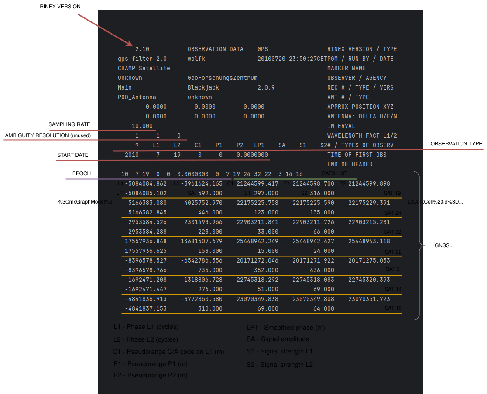
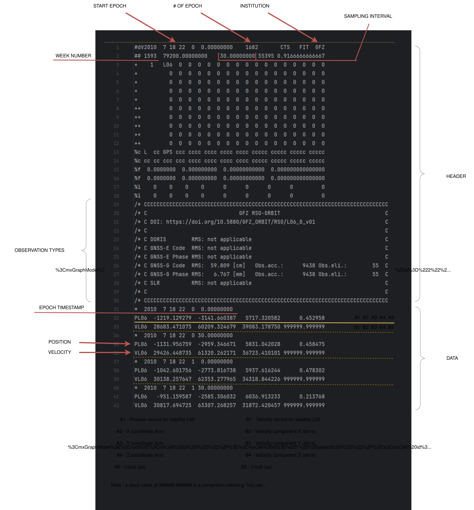

# Moteur POD

Le moteur POD est le cœur de calcul de SpaceBench. Lorsqu'une exécution est soumise, le backend lance le moteur en tant que tâche asynchrone. Le moteur reçoit les fichiers déjà téléversés, les métadonnées de validation et la configuration de l'exécution, puis exécute le pipeline scientifique de détermination d'orbite.

---

## 1. Fichiers d'entrée

Le pipeline nécessite des données d'observation de mission, des produits GNSS précis et une orbite de référence.

### Provenant de la mission (ex. GFZ / ISDC pour CHAMP)

**Observations RINEX 2** (`.rnx`)

Observations du récepteur GPS embarqué enregistrées par le satellite en orbite basse (LEO). Les fichiers de test CHAMP contiennent des observations de pseudodistance, de phase porteuse et Doppler. Dans l'implémentation POD actuelle, l'observable utilisé est :

| Observable | Signification | Unité |
|------------|---------------|-------|
| `C1` | Pseudodistance GPS code C/A | mètres |



Le fichier RINEX est parsé avec `georinex` et devient un `xarray.Dataset`. Pour les données de test CHAMP, la cadence d'observation est d'environ 10 secondes.

**RSO SP3 - Orbite Standard de Référence** (`.sp3`)

Les fichiers RSO SP3 fournissent la trajectoire de référence du satellite LEO. Ils ne sont pas utilisés pour former les équations d'observation GNSS. Ils sont utilisés après l'estimation pour comparer la trajectoire calculée de CHAMP avec l'orbite de référence.



Pour CHAMP, l'identifiant du satellite de référence est `L06`. Les fichiers RSO contiennent des positions ECEF en kilomètres et peuvent contenir des vitesses selon le mode SP3. Deux arcs superposés peuvent être utilisés pour un jour d'observation.

!!! note "Arcs RSO superposés"
    Lorsque deux arcs RSO SP3 sont concaténés, les époques en chevauchement produisent des entrées dupliquées. La fonction `get_rso_epoch_data()` gère ce cas en ignorant les époques dont la forme est inattendue, de sorte qu'aucune comparaison n'est effectuée pour ces époques.

### Provenant d'IGS / CDDIS

**IGS SP3 - orbites GPS précises** (`.sp3`)

Le fichier IGS SP3 fournit les positions précises des satellites GPS, généralement à intervalles de 15 minutes. Ces positions sont nécessaires pour calculer la distance géométrique entre chaque satellite GPS et la position inconnue du récepteur CHAMP.

L'implémentation actuelle parse ce fichier avec `georinex` et interpole la trajectoire de chaque satellite GPS aux époques d'observation RINEX.

**IGS CLK_30S - horloges GPS précises** (`.clk_30s`)

Le fichier CLK fournit les biais d'horloge précis des satellites GPS à intervalles de 30 secondes. L'implémentation actuelle parse les enregistrements `AS` avec un parseur personnalisé :

```python
clock_corrections[sv][datetime] = bias_seconds
```


!!! warning "Pourquoi CLK_30S est obligatoire"
    Dans l'équation d'observation de pseudodistance, le terme d'horloge satellite est multiplié par la vitesse de la lumière et affecte directement la distance modélisée. Pour cette raison, SpaceBench utilise le produit dédié CLK_30S au lieu de se fier uniquement aux valeurs d'horloge intégrées dans le fichier d'orbite SP3 à 15 minutes. Ceci suit la modélisation standard des observations GNSS décrite par Montenbruck & Gill.

---

## 2. Données reçues par le moteur

Avant le démarrage du moteur, le backend a déjà téléversé et pré-validé chaque fichier. Le moteur reçoit deux objets importants :

| Objet | Contenu |
|-------|---------|
| `config` | identifiants de fichiers, chemins de stockage, modèle orbital, type d'estimateur, chemin de l'estimateur (si personnalisé), nombre max d'itérations, tolérance |
| `metadata` | métadonnées de validation extraites par les validateurs du backend |

Les métadonnées actuellement utilisées par le moteur sont :

| Champ de métadonnées | Fichier source | Utilisé dans |
|----------------------|----------------|--------------|
| `rinex.start_epoch` | Fichier d'observation RINEX | init, validation croisée |
| `gnss_sp3.start_epoch` | Fichier d'orbite IGS SP3 | init, validation croisée |
| `clk.first_as_timestamp` | Fichier IGS CLK | init, validation croisée |
| `rso_sp3[*].start_epoch` | Fichiers de référence RSO SP3 | init, validation croisée |

Ceci n'est pas identique au parsing scientifique. La pré-validation extrait des métadonnées légères et détecte les fichiers mal formés en amont. Le moteur POD parse ensuite le contenu scientifique durant la phase de parsing.

---

## 3. Modèles orbitaux

Le modèle orbital définit comment la trajectoire du satellite LEO est paramétrée durant l'estimation.

| Modèle | Principe | Rôle actuel |
|--------|----------|-------------|
| Cinématique | Estimer une position indépendante à chaque époque | **Implémenté** |
| Dynamique | Estimer une orbite contrainte par les équations du mouvement | Non implémenté, hors périmètre MVP |
| Réduit-dynamique | Combiner la dynamique avec des paramètres empiriques | Non implémenté, hors périmètre MVP |

L'implémentation actuelle se concentre sur le modèle cinématique car il constitue le chemin le plus court vers un résultat POD fonctionnel : chaque époque peut être résolue indépendamment à partir des observations de pseudodistance disponibles à cette époque.

---

## 4. Estimateurs

L'estimateur résout les équations d'observation et produit la trajectoire estimée.

### Registre des estimateurs

Les estimateurs disponibles sont enregistrés dans un registre central et résolus par nom à l'exécution :

```python
REGISTRY: dict[str, type[BaseEstimator]] = {
    "BLSQ": LSQEstimator,
    "KF":   KFEstimator,
    "UKF":  UKFEstimator,
    "EKF":  EKFEstimator,
    "custom": CustomEstimator
}
```

| Estimateur | Classe | Statut |
|------------|--------|--------|
| Moindres carrés batch | `LSQEstimator` | **Implémenté** |
| Filtre de Kalman | `KFEstimator` | Non implémenté, hors périmètre MVP |
| Filtre de Kalman étendu | `EKFEstimator` | Non implémenté, hors périmètre MVP |
| Filtre de Kalman unscented | `UKFEstimator` | Non implémenté, hors périmètre MVP |
| Plugin personnalisé | `CustomEstimator` | **Implémenté** (chargement dynamique) |

Tous les estimateurs étendent `BaseEstimator`, qui définit l'interface :

```python
class BaseEstimator(ABC):
    def __init__(self, config, logger: RunLogger):
        self.config = config
        self.logger = logger
        self.previous_state: np.ndarray | None = None

    @abstractmethod
    def estimate_epoch(self, epoch_obs: dict, initial_state: np.ndarray) -> tuple[np.ndarray, dict]:
        pass
```

### Estimateur par moindres carrés (BLSQ)

L'estimateur cible actuel est un solveur par moindres carrés époque par époque, utilisant le modèle de pseudodistance de Montenbruck & Gill, chapitre 8.

L'état estimé pour une époque est :

```text
x = [X, Y, Z, dtr]
```

| Inconnue | Signification | Unité interne |
|----------|---------------|---------------|
| `X, Y, Z` | Position ECEF du récepteur CHAMP | mètres |
| `dtr` | Biais d'horloge récepteur en distance | mètres |

Au moins quatre satellites GPS valides sont nécessaires à une époque car il y a quatre inconnues.

L'algorithme itère jusqu'à ce que la norme de correction de position passe en dessous de la tolérance configurée, ou que le nombre maximum d'itérations soit atteint. À chaque itération :

1. Calculer la distance géométrique `ρ` entre l'estimation actuelle de la position du récepteur et chaque satellite ;
2. Calculer la pseudodistance modélisée : `P_calculé = ρ + dtr - c · dt_sat` ;
3. Former le résidu : `P_observé - P_calculé` ;
4. Construire la ligne du Jacobien : `[dx/ρ, dy/ρ, dz/ρ, 1.0]` ;
5. Résoudre le système surdéterminé avec `numpy.linalg.lstsq` ;
6. Appliquer la correction au vecteur d'état.

Le critère de convergence est :

```python
position_correction_norm = sqrt(dx² + dy² + dz²) < tolérance
```

### Plugin estimateur personnalisé

Les utilisateurs peuvent téléverser un fichier `.py` implémentant `BaseEstimator`. La classe `CustomEstimator` utilise `importlib` pour charger dynamiquement le fichier téléversé à l'exécution :

1. Charger le module Python depuis le chemin du fichier avec `importlib.util` ;
2. Découvrir automatiquement la première classe qui étend `BaseEstimator` ;
3. L'instancier avec les mêmes `config` et `logger` ;
4. Déléguer tous les appels `estimate_epoch` au plugin chargé.

Ceci permet aux utilisateurs d'expérimenter avec leurs propres algorithmes d'estimation sans modifier le code source de SpaceBench.

### Équation d'observation

L'équation d'observation de pseudodistance utilisée dans l'estimateur par moindres carrés suit le modèle de positionnement par code :

```text
R^j = ρ^j + c(δt_rcv - δt^j_sat) + ε^j
```

| Symbole | Signification | Source |
|---------|---------------|--------|
| `R^j` | Pseudodistance observée pour le satellite j | RINEX `C1` |
| `ρ^j` | Distance géométrique `sqrt(dx² + dy² + dz²)` | Calculée à partir de l'état et d'IGS SP3 |
| `c` | Vitesse de la lumière (299 792 458 m/s) | Constante |
| `δt_rcv` | Biais d'horloge récepteur | Estimé (4ème inconnue) |
| `δt^j_sat` | Biais d'horloge satellite | IGS CLK_30S |
| `ε^j` | Bruit de mesure / résidu | Implicite |

Les sources d'erreur suivantes ne sont pas modélisées dans le MVP actuel :

| Source | Symbole | Raison |
|--------|---------|--------|
| Retard troposphérique | `T^j` | L'altitude LEO (~400 km) est au-dessus de la troposphère |
| Retard ionosphérique | `α·I^j` | Nécessite des observations bi-fréquence |
| Retard de groupe satellite | `TGD^j` | Effet du second ordre |
| Multitrajets | `M^j` | Dépendant de l'environnement |

---

## 5. Pipeline scientifique

Le pipeline du moteur est implémenté sous forme de fonctions indépendantes :

```text
run_pod_pipeline()
  -> init()
  -> cross_validate()
  -> parse()
  -> estimate()
  -> save_results()
```

Chaque phase écrit des logs via `RunLogger`. Ces logs sont stockés en base de données et affichés dans la console de logs du frontend.

### Phases du pipeline

| Phase | Fonction | Description | Statut |
|-------|----------|-------------|--------|
| **1 - Init** | `init()` | Charger les métadonnées produites par la validation backend | **Implémenté** |
| **2 - Validation croisée** | `cross_validate()` | Vérifier que les fichiers couvrent une fenêtre temporelle cohérente | **Implémenté** |
| **3 - Parsing** | `parse()` | Charger les données RINEX, GNSS SP3, CLK et RSO | **Implémenté** |
| **4 - Estimation** | `estimate()` | Interpoler les produits et résoudre les moindres carrés cinématiques | **Implémenté** |
| **5 - Résultats** | `save_results()` | Comparer avec le RSO et persister les métriques RMS | **Implémenté** |

---

## Phase 1 - Init

La phase d'initialisation démarre l'exécution et extrait les métadonnées nécessaires avant le parsing.

Valeurs actuellement extraites :

| Valeur | Signification |
|--------|---------------|
| `rinex_start` | époque de début d'observation depuis les métadonnées RINEX |
| `gnss_clk_start` | premier horodatage `AS` depuis les métadonnées CLK |
| `gnss_sp3_start` | époque de début IGS SP3 |
| `rso_sp3_start` | liste des époques de début RSO SP3 |

Si un champ de métadonnées requis est manquant, l'exécution est marquée comme `failed`.

---

## Phase 2 - Validation croisée

Cette phase vérifie si les fichiers sélectionnés sont compatibles entre eux.

Vérifications actuelles :

| Vérification | Règle |
|-------------|-------|
| RINEX vs IGS SP3 | les époques de début doivent correspondre à 60 secondes près |
| RINEX vs IGS CLK | les époques de début doivent correspondre à 60 secondes près |
| IGS SP3 vs IGS CLK | les époques de début doivent correspondre à 60 secondes près |
| RINEX vs arcs RSO SP3 | la couverture RSO doit inclure l'époque de début RINEX |

Les fichiers RSO sont traités différemment des produits IGS car les arcs d'orbite de référence peuvent chevaucher le jour d'observation. Pour CHAMP, l'ensemble RSO téléversé peut contenir deux arcs autour du jour cible.

Vérifications futures possibles hors MVP :

| Vérification | Raison |
|-------------|--------|
| Couverture complète de la fenêtre temporelle RINEX | Prévenir les lacunes d'interpolation dans le pipeline |
| Compatibilité des constellations satellites | Les données actuelles sont GPS uniquement |
| Nombre minimum de satellites utilisables par époque | Les moindres carrés nécessitent au moins quatre observations |

---

## Phase 3 - Parsing

La phase de parsing charge le contenu scientifique à l'aide de la bibliothèque Python `georinex`.

### Observations RINEX

```python
rnx_obs = gr.load(rinex_file)
```

La variable de données importante est :

```python
observations["C1"]
```

Pour chaque époque, les pseudodistances manquantes sont supprimées :

```python
pseudoranges = observations["C1"].sel(time=epoch).dropna("sv")
```

### Orbite de référence RSO

Chaque fichier RSO SP3 est chargé avec `georinex`, puis les arcs sont concaténés :

```python
rso_combined = xarray.concat(rso_obs, dim="time").sortby("time")
```

Ceci produit la vérité de référence utilisée durant la phase de résultats.

!!! warning "Arcs superposés"
    Lorsque deux arcs RSO se chevauchent dans le temps, les époques dupliquées auront une forme `(2, 3)` au lieu de `(3,)`. La fonction `get_rso_epoch_data()` gère ce cas en ignorant les époques avec des formes inattendues, de sorte qu'aucune comparaison n'est effectuée pour ces époques.

### Orbites précises IGS SP3

Le fichier GNSS SP3 est chargé avec `georinex` :

```python
gnss_sp3_obs = gr.load(gnss_sp3_path)
```

La variable de données importante est :

```python
precise_product["position"]
```

Les positions sont fournies en kilomètres par le format SP3 et doivent être converties en mètres avant de calculer les distances par rapport aux pseudodistances RINEX.

### Horloges précises IGS CLK

Le fichier CLK est parsé par `parse_clk()`, qui ne conserve que les enregistrements d'horloge satellite :

```text
AS Gxx yyyy mm dd hh mm ss.sssss bias_seconds
```

La sortie est :

```python
{
    "G01": {
        datetime(...): bias_seconds,
        ...
    },
    ...
}
```

### Sorties du parsing

La fonction `parse()` retourne :

| Clé | Type | Description |
|-----|------|-------------|
| `observations` | `xarray.Dataset` | Observations RINEX, incluant les pseudodistances `C1` |
| `precise_product` | `xarray.Dataset` | Positions des satellites GPS IGS |
| `clock_corrections` | `dict` | Biais d'horloge satellite CLK |
| `reference_truth` | `xarray.Dataset` | Trajectoire de référence RSO concaténée |

---

## Phase 4 - Estimation

La phase d'estimation effectue l'interpolation, construit les observations par époque et exécute l'estimateur sélectionné.

### Interpolation

Les produits d'observation, d'orbite et d'horloge ne partagent pas la même cadence :

| Données | Cadence | Méthode d'interpolation |
|---------|---------|-------------------------|
| Observations RINEX `C1` | ~10 secondes | époques cibles |
| Positions satellites IGS SP3 | 15 minutes | spline cubique (`scipy.interpolate.CubicSpline`) |
| Horloges satellites IGS CLK | 30 secondes | interpolation linéaire (`numpy.interp`) |

Interpolation SP3 :

```python
cs = CubicSpline(sp3_seconds[mask], x[mask])
interpolated[sv] = cs(target_seconds)
```

Les satellites avec moins de 4 points de données valides sont ignorés (la spline cubique nécessite au moins 4 points).

Interpolation CLK :

```python
interpolated[sv] = np.interp(target_seconds, clk_seconds, biases)
```

### Construction des observations par époque

Pour chaque époque RINEX, la fonction `build_epoch_observations()` assemble les données nécessaires à l'estimateur :

| Champ | Source | Unité |
|-------|--------|-------|
| `P` | Pseudodistance RINEX `C1` | mètres |
| `sat_pos` | Position IGS SP3 interpolée (km → m) | mètres |
| `dt_sat` | Biais d'horloge IGS CLK interpolé | secondes |

Les satellites sont filtrés si l'un des éléments suivants est manquant ou `NaN` : pseudodistance, position interpolée ou biais d'horloge. Si moins de 4 satellites valides subsistent, l'époque est ignorée.

### État initial

L'état initial du récepteur pour la première époque est dérivé de l'orbite de référence RSO :

```python
initial_state = [x_m, y_m, z_m, 0.0]  # position en mètres + biais d'horloge nul
```

Pour les époques suivantes, l'état estimé précédent est utilisé comme estimation initiale, permettant une convergence plus rapide.

### Boucle d'estimation

```text
pour chaque époque RINEX :
    1. construire les observations de l'époque (P, sat_pos, dt_sat)
    2. ignorer si < 4 satellites valides
    3. définir l'état initial (RSO pour la première époque, estimation précédente sinon)
    4. appeler estimator.estimate_epoch(epoch_obs, initial_state)
    5. stocker l'état estimé
    6. comparer avec la référence RSO (si disponible) → calculer le vecteur d'erreur
```

---

## Phase 5 - Résultats

La phase de résultats compare les positions estimées avec la trajectoire de référence RSO et persiste les métriques.

### RMS 3D

L'erreur RMS 3D est calculée dans le référentiel ECEF :

```python
rms_3d = sqrt(mean(ΔX² + ΔY² + ΔZ²))
```

où `ΔX, ΔY, ΔZ` sont les composantes d'erreur de position à chaque époque.

Le résultat est stocké en base de données en **centimètres**.

### Métriques actuelles

| Métrique | Statut |
|----------|--------|
| RMS 3D | **Implémenté** |
| RMS radial | Non implémenté |
| RMS along-track | Non implémenté |
| RMS cross-track | Non implémenté |

!!! info "Décomposition RTN"
    La décomposition d'erreur RTN (Radiale, Transverse, Normale) n'est pas implémentée et est en dehors du périmètre de ce projet. Seul le RMS 3D dans le référentiel ECEF est calculé.

---

## 6. Mode debug

Un flag global `DEBUG_MODE` peut être activé dans `app/core/settings.py` :

```python
DEBUG_MODE: bool = True
```

Lorsqu'il est activé, des informations supplémentaires sont affichées dans la console durant l'exécution, incluant les chemins de fichiers, les valeurs parsées, les positions estimées et les vecteurs d'erreur. Ceci est utile pour le développement et le dépannage mais devrait être désactivé en production ou lors de présentations.

---

## 7. Statuts d'exécution

| Statut | Signification |
|--------|---------------|
| `pending` | Exécution créée, pipeline pas encore démarré |
| `running` | Pipeline en cours |
| `done` | Pipeline terminé avec succès, résultats RMS disponibles |
| `failed` | Le pipeline a rencontré une erreur irrécupérable |

---

## 8. Résumé de l'implémentation

### Implémenté

1. Extraction des métadonnées depuis la validation backend
2. Validation temporelle croisée des fichiers (tolérance de 60 secondes)
3. Parsing RINEX, SP3, CLK et RSO avec `georinex`
4. Concaténation des arcs RSO
5. Interpolation SP3 par spline cubique aux époques d'observation
6. Interpolation CLK linéaire aux époques d'observation
7. Extraction et filtrage des satellites visibles par époque
8. Conversion d'unités des kilomètres SP3 en mètres
9. Correction d'horloge satellite dans l'équation d'observation
10. Construction de la matrice Jacobienne et du vecteur de résidus
11. Solution itérative par moindres carrés (`numpy.linalg.lstsq`)
12. Nombre max d'itérations et tolérance de convergence configurables
13. Stockage de la trajectoire estimée par époque
14. Comparaison RSO et calcul du RMS 3D
15. Persistance des résultats en base de données
16. Registre d'estimateurs avec résolution à l'exécution
17. Système de plugin estimateur personnalisé via `importlib`
18. Journalisation par phase via `RunLogger`
19. Mode debug configurable

### Non implémenté (hors périmètre MVP)

1. Décomposition RTN (Radiale, Transverse, Normale)
2. Modèles orbitaux dynamique et réduit-dynamique
3. Estimateurs Filtre de Kalman, Filtre de Kalman étendu, Filtre de Kalman unscented
4. Corrections d'erreurs troposphériques, ionosphériques et multitrajet
5. Correction du retard de groupe satellite (TGD)
6. Validation de couverture complète de la fenêtre temporelle
7. Support multi-constellation (actuellement GPS uniquement)