# Interface utilisateur

Cette page présente l'interface SpaceBench écran par écran.

---

## Connexion

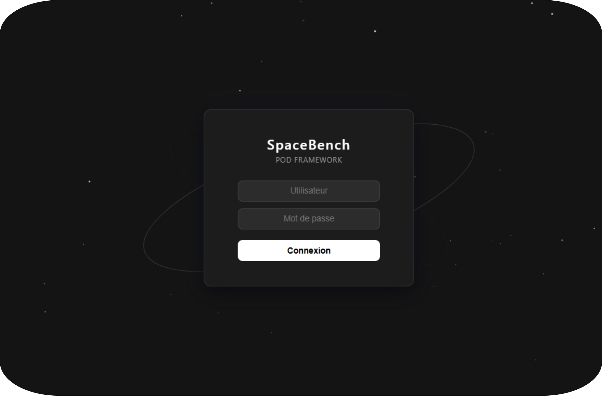

Les identifiants par défaut peuvent être trouvés → ici ←

---

## Tableau de bord

Le tableau de bord est la vue principale après connexion. Il regroupe l'entièreté des données de traitement POD. On y retrouve un tableau filtrable et paginé, ainsi qu'un histogramme pour la visualisation graphique.

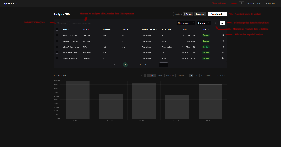

Il est possible d'afficher uniquement un des deux composants, ou même d'élargir la vue via les boutons "Vue Large", "Tableau" et "Histogramme". 

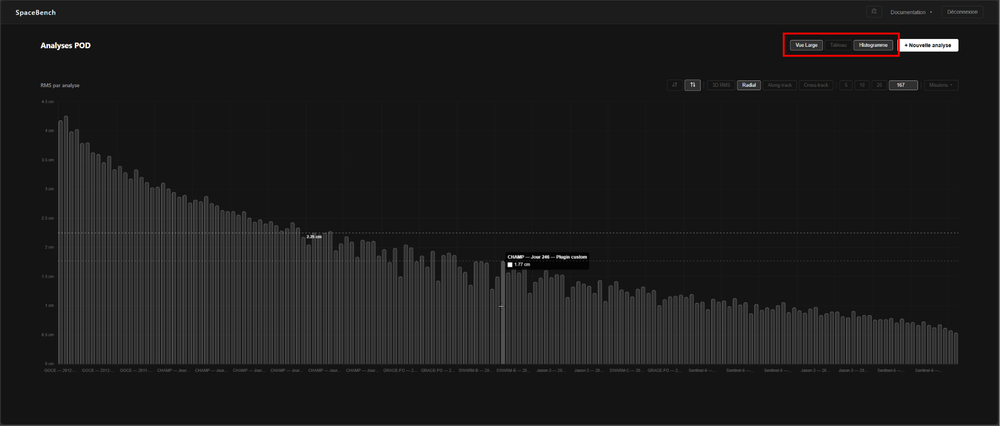

### Tableau 

Il affiche toutes les analyses POD dans un tableau paginé. Il est possible d'afficher/cacher des colonnes, de télécharger les données au format CSV, trier les colonnes de manière ascendante ou descendante, ainsi que voir les logs de la mission concernée.

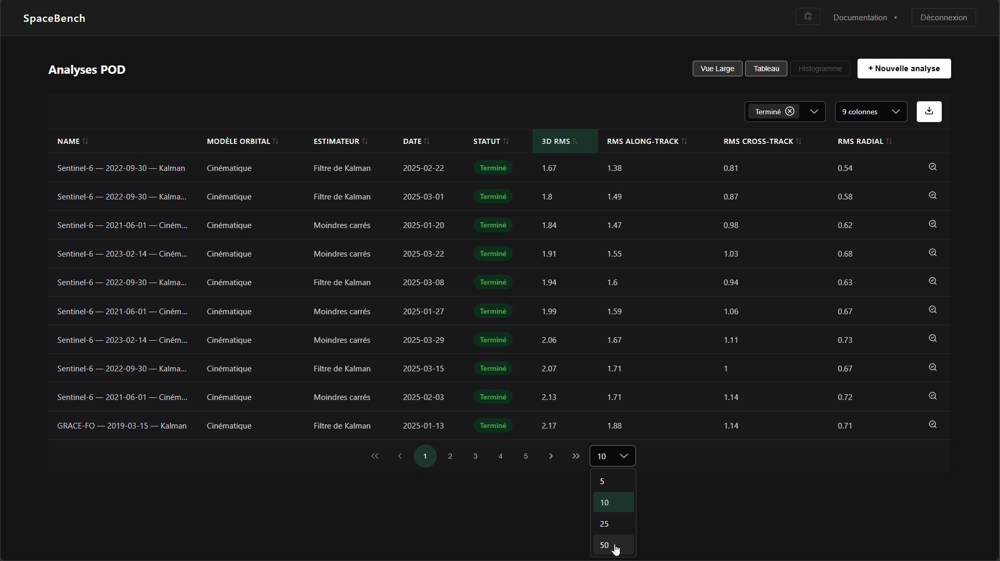

Cliquer sur l'**icône de log** d'une ligne ouvre le visualiseur de logs pour cette analyse.

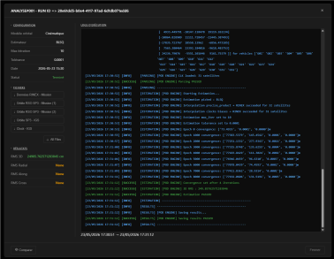

Il est aussi possible de comparer les résultats avec une autre analyse en cliquant sur le bouton **Comparer** en bas à gauche.

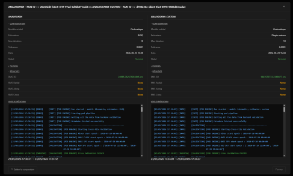

### Histogramme

L'**histogramme** en bas de la page représente les résultats RMS sur toutes les analyses. Il est possible d'afficher les résultats en 3D RMS, Radial, Along-track, Cross-Track. Il est aussi possible de choisir les missions affichées, ou bien d'en choisir le nombre, ainsi que leur ordre.

Cliquez sur une barre de l'histogramme pour afficher une ligne horizontale qui servira de référence.

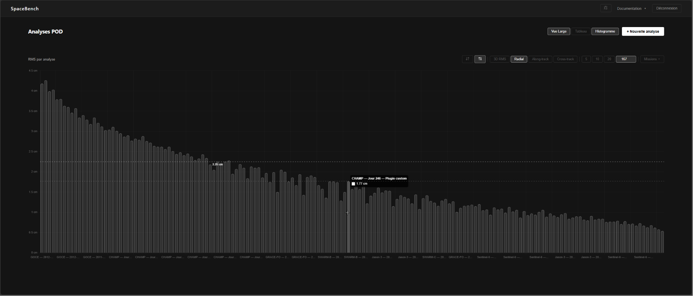

---

## Nouvelle analyse — assistant en 4 étapes

### Étape 1 — Upload des fichiers

*Uploadez* les 4 fichiers d'entrée requis :

| Fichier | Format | Source |
|---------|--------|--------|
| Observations RINEX | `.rnx` | Fournisseur mission, par exemple GFZ / ISDC pour CHAMP |
| Orbites précises IGS SP3 | `.sp3` | IGS / CDDIS |
| Corrections d'horloges IGS CLK_30S | `.clk_30s` | IGS / CDDIS |
| Orbite de référence RSO SP3 | `.sp3` | Fournisseur mission, par exemple GFZ / ISDC pour CHAMP |

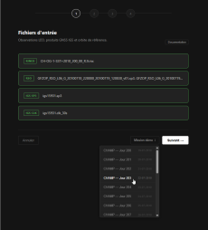

!!! note
    Les données de démonstration CHAMP des jours 200 à 219 et du jour 246 peuvent être chargées automatiquement via le bouton **Mission démo**.

Chaque fichier uploadé est pré-validé automatiquement. Si un fichier est invalide, il sera mis en évidence en rouge avec un message d'erreur. La liste complète des erreurs de pré-validation est disponible dans la [Liste des erreurs](../error-list/).

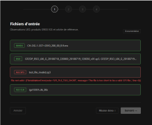

!!! info "Documentation intégrée"
    Une documentation est disponible directement depuis le frontend via le bouton **Documentation**. L'utilisateur peut y retrouver les codes d'erreurs de pré-validation (également disponibles dans la [Liste des erreurs](../error-list/)) ainsi que la décomposition détaillée de chacun des formats de fichiers supportés (`.rnx`, `.sp3`, `.clk_30s`).

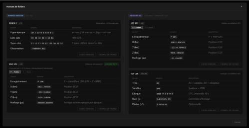

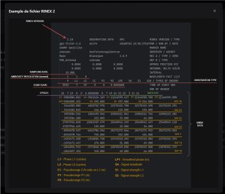

### Étape 2 — Modèle orbital

Seul le modèle **Cinématique** est disponible. Dynamique et Réduit-Dynamique ne sont pas implémentés.

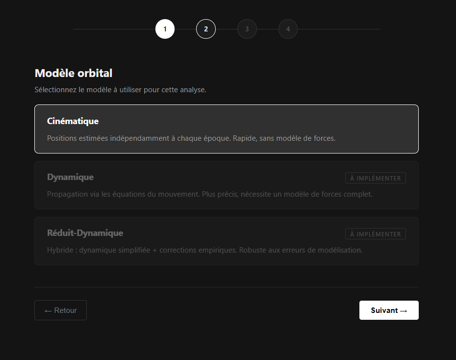

### Étape 3 — Estimateur

- **Moindres Carrés** — estimateur cible actuel - La documentation est accessible ici : []
- **Filtre de Kalman** — non implémenté et hors périmètre du MVP
- **Filtre de Kalman Extended** — non implémenté et hors périmètre du MVP
- **Filtre de Kalman Unscented** — non implémenté et hors périmètre du MVP
- **Plugin personnalisé** — *uploadez* un fichier `.py` implémentant l'interface `BaseEstimator`

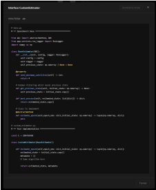

L'utilisateur peut également configurer le **nombre maximum d'itérations** ainsi que le **seuil de convergence** (tolérance). Ces paramètres contrôlent le critère d'arrêt de l'estimateur : l'algorithme s'arrête lorsque la correction de position passe en dessous de la tolérance, ou lorsque le nombre maximum d'itérations est atteint.

!!! tip "Estimateur personnalisé"
    Il est possible d'étendre les fonctionnalités du programme en important un estimateur personnalisé. Votre fichier `.py` doit contenir une classe héritant de `BaseEstimator` et implémenter la méthode `estimate_epoch`. Cliquez sur le bouton **Documentation** pour consulter le contrat d'interface. Un fichier template est disponible au téléchargement via le bouton **download example**.

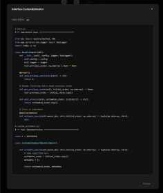

Le fichier estimateur est également pré-validé lors de l'upload. Voir la [Liste des erreurs](../error-list/) pour plus de détails.

### Étape 4 — Nom et lancement

Vérifiez les informations de l'analyse qui va être lancée.

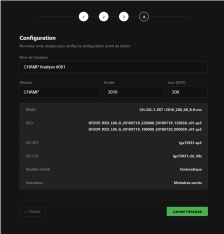

Si tout vous semble en ordre, donnez un nom à l'analyse et confirmez. Le pipeline démarre immédiatement en arrière-plan.

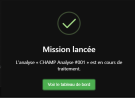

---

## Barre de navigation

Il est possible via la barre de navigation d'accéder à la documentation (MkDocs, Swagger, ReDOC), de lancer les tests unitaires ou de se déconnecter.

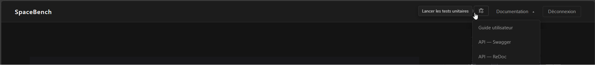

## Tests unitaires

Lance les tests unitaires de la plateforme et affiche les résultats.

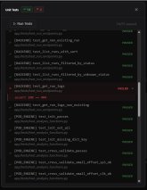

La liste des tests unitaires peut être trouvée dans la [Liste des tests unitaires](../unit-test/).