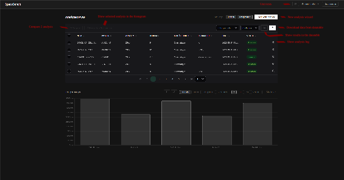

# User Interface

This page walks through the SpaceBench interface screen by screen.

---

## Login

Default credentials can be found → here ←

---

## Dashboard

The dashboard is the main view after login. It centralises all POD processing data, featuring a filterable paginated table and a histogram for graphical visualisation.

It is possible to show only one of the two components, or to widen the view using the "Wide View", "Table" and "Histogram" buttons.

### Table

Displays all POD runs in a paginated table. Columns can be shown or hidden, data can be exported as CSV, columns can be sorted ascending or descending, and the logs for any run can be viewed.

Clicking the **log icon** on a row opens the log viewer for that run.

It is also possible to compare results with another analysis by clicking the **Compare** button at the bottom left.

### Histogram

The **histogram** at the bottom of the page shows RMS results across all runs. Results can be displayed as 3D RMS, Radial, Along-track, or Cross-Track. It is also possible to choose which runs are shown, their count, and their order.

Click a bar in the histogram to display a horizontal reference line.

---

## New Analysis — 4-step wizard

### Step 1 — Upload files

*Upload* the 4 required input files:

| File | Format | Source |
|------|--------|--------|
| RINEX observations | `.rnx` | Mission provider, e.g. GFZ / ISDC for CHAMP |
| IGS SP3 precise orbits | `.sp3` | IGS / CDDIS |
| IGS CLK_30S clock corrections | `.clk_30s` | IGS / CDDIS |
| RSO SP3 reference orbit | `.sp3` | Mission provider, e.g. GFZ / ISDC for CHAMP |

!!! note
    Demo data for CHAMP days 200 to 219 and day 246 can be loaded automatically via the **Demo Mission** button.

Each uploaded file is pre-validated automatically. If a file is invalid, it will be highlighted in red with an error message. A full list of pre-validation errors can be found in the [Error List](../error-list/).

!!! info "Built-in documentation"
    Documentation is available directly from the frontend via the **Documentation** button. Users can find pre-validation error codes (also available in the [Error List](../error-list/)) as well as a detailed breakdown of each supported file format (`.rnx`, `.sp3`, `.clk_30s`).

### Step 2 — Orbital model

Only **Kinematic** is available. Dynamic and Reduced-Dynamic are not implemented.

### Step 3 — Estimator

- **Least Squares** — current target estimator - The documentation is accessible here : []
- **Kalman filter** — not implemented and outside the MVP scope
- **Extended Kalman filter** — not implemented and outside the MVP scope
- **Unscented Kalman filter** — not implemented and outside the MVP scope
- **Custom plugin** — *upload* a `.py` file implementing the `BaseEstimator` interface

The user can also configure the **maximum number of iterations** and the **convergence threshold** (tolerance). These parameters control the estimator's stopping criterion: the algorithm stops when the position correction falls below the tolerance, or when the maximum number of iterations is reached.

!!! tip "Custom Estimator"
    It is possible to extend the program's functionality by importing a custom estimator. Your `.py` file must contain a class extending `BaseEstimator` and implement the `estimate_epoch` method. Click the **Documentation** button to view the interface contract. A template is available to download via the button **download example**.

The estimator file is also pre-validated upon upload. See the [Error List](../error-list) for details.

### Step 4 — Name and launch

Review the run summary before launching.

Give the run a name and confirm. The pipeline starts immediately in the background.

---

## Navigation bar

The navigation bar provides access to the documentation (MkDocs, Swagger, ReDoc), unit testing, or logout.

## Unit testing

Runs the platform's unit tests and displays the results.

The list of unit tests can be found in the [unit test page](../unit-test/).
